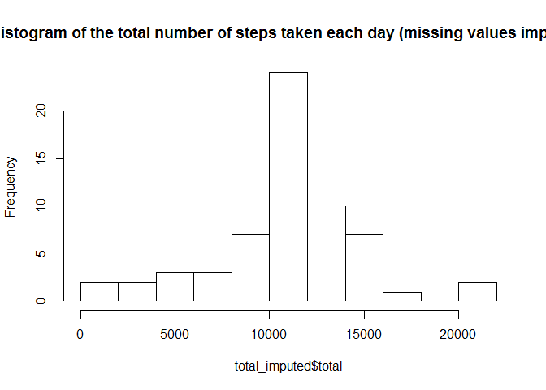

# Reproducible Research: Peer Assessment 1


## Loading and preprocessing the data
1. Load the data 

```r
setwd("C:/Users/grouby/Desktop/Coursera/Rep_Assignement1/RepData_PeerAssessment1")
unzip("repdata-data-activity.zip")
data <- read.table("activity.csv", sep = ",", header=TRUE, na.strings = "NA")
```
2. Process/transform the data (if necessary) into a format suitable for your analysis

```r
data$date <- as.Date(data$date, format="%Y-%m-%d")
```

## What is mean total number of steps taken per day?

```r
library(dplyr)
```

```
## Warning: package 'dplyr' was built under R version 3.1.3
```

```r
library(knitr)
data <- tbl_df(data)
```
1. Calculate the total number of steps taken per day

```r
total <- data %>% group_by(date) %>% summarize(total=sum(steps, na.rm=TRUE))
```


date          total
-----------  ------
2012-10-01        0
2012-10-02      126
2012-10-03    11352
2012-10-04    12116
2012-10-05    13294
2012-10-06    15420
2012-10-07    11015
2012-10-08        0
2012-10-09    12811
2012-10-10     9900
2012-10-11    10304
2012-10-12    17382
2012-10-13    12426
2012-10-14    15098
2012-10-15    10139
2012-10-16    15084
2012-10-17    13452
2012-10-18    10056
2012-10-19    11829
2012-10-20    10395
2012-10-21     8821
2012-10-22    13460
2012-10-23     8918
2012-10-24     8355
2012-10-25     2492
2012-10-26     6778
2012-10-27    10119
2012-10-28    11458
2012-10-29     5018
2012-10-30     9819
2012-10-31    15414
2012-11-01        0
2012-11-02    10600
2012-11-03    10571
2012-11-04        0
2012-11-05    10439
2012-11-06     8334
2012-11-07    12883
2012-11-08     3219
2012-11-09        0
2012-11-10        0
2012-11-11    12608
2012-11-12    10765
2012-11-13     7336
2012-11-14        0
2012-11-15       41
2012-11-16     5441
2012-11-17    14339
2012-11-18    15110
2012-11-19     8841
2012-11-20     4472
2012-11-21    12787
2012-11-22    20427
2012-11-23    21194
2012-11-24    14478
2012-11-25    11834
2012-11-26    11162
2012-11-27    13646
2012-11-28    10183
2012-11-29     7047
2012-11-30        0


2.  Make a histogram of the total number of steps taken each day

```r
hist(total$total, breaks=10, main="Histogram of the total number of steps taken each day")
```

 

3. Calculate and report the mean and median of the total number of steps taken per day


```r
mean <- data %>% group_by(date) %>% summarize(mean=mean(steps, na.rm=TRUE))
median <- data %>% group_by(date) %>% summarize(median=median(steps, na.rm=TRUE))
```


date                mean
-----------  -----------
2012-10-01           NaN
2012-10-02     0.4375000
2012-10-03    39.4166667
2012-10-04    42.0694444
2012-10-05    46.1597222
2012-10-06    53.5416667
2012-10-07    38.2465278
2012-10-08           NaN
2012-10-09    44.4826389
2012-10-10    34.3750000
2012-10-11    35.7777778
2012-10-12    60.3541667
2012-10-13    43.1458333
2012-10-14    52.4236111
2012-10-15    35.2048611
2012-10-16    52.3750000
2012-10-17    46.7083333
2012-10-18    34.9166667
2012-10-19    41.0729167
2012-10-20    36.0937500
2012-10-21    30.6284722
2012-10-22    46.7361111
2012-10-23    30.9652778
2012-10-24    29.0104167
2012-10-25     8.6527778
2012-10-26    23.5347222
2012-10-27    35.1354167
2012-10-28    39.7847222
2012-10-29    17.4236111
2012-10-30    34.0937500
2012-10-31    53.5208333
2012-11-01           NaN
2012-11-02    36.8055556
2012-11-03    36.7048611
2012-11-04           NaN
2012-11-05    36.2465278
2012-11-06    28.9375000
2012-11-07    44.7326389
2012-11-08    11.1770833
2012-11-09           NaN
2012-11-10           NaN
2012-11-11    43.7777778
2012-11-12    37.3784722
2012-11-13    25.4722222
2012-11-14           NaN
2012-11-15     0.1423611
2012-11-16    18.8923611
2012-11-17    49.7881944
2012-11-18    52.4652778
2012-11-19    30.6979167
2012-11-20    15.5277778
2012-11-21    44.3993056
2012-11-22    70.9270833
2012-11-23    73.5902778
2012-11-24    50.2708333
2012-11-25    41.0902778
2012-11-26    38.7569444
2012-11-27    47.3819444
2012-11-28    35.3576389
2012-11-29    24.4687500
2012-11-30           NaN


date          median
-----------  -------
2012-10-01        NA
2012-10-02         0
2012-10-03         0
2012-10-04         0
2012-10-05         0
2012-10-06         0
2012-10-07         0
2012-10-08        NA
2012-10-09         0
2012-10-10         0
2012-10-11         0
2012-10-12         0
2012-10-13         0
2012-10-14         0
2012-10-15         0
2012-10-16         0
2012-10-17         0
2012-10-18         0
2012-10-19         0
2012-10-20         0
2012-10-21         0
2012-10-22         0
2012-10-23         0
2012-10-24         0
2012-10-25         0
2012-10-26         0
2012-10-27         0
2012-10-28         0
2012-10-29         0
2012-10-30         0
2012-10-31         0
2012-11-01        NA
2012-11-02         0
2012-11-03         0
2012-11-04        NA
2012-11-05         0
2012-11-06         0
2012-11-07         0
2012-11-08         0
2012-11-09        NA
2012-11-10        NA
2012-11-11         0
2012-11-12         0
2012-11-13         0
2012-11-14        NA
2012-11-15         0
2012-11-16         0
2012-11-17         0
2012-11-18         0
2012-11-19         0
2012-11-20         0
2012-11-21         0
2012-11-22         0
2012-11-23         0
2012-11-24         0
2012-11-25         0
2012-11-26         0
2012-11-27         0
2012-11-28         0
2012-11-29         0
2012-11-30        NA


## What is the average daily activity pattern?
1. Make a time series plot of the 5-minute interval (x-axis) and the average number of steps taken, averaged across all days (y-axis)

```r
five_minutes <- data %>% group_by(interval) %>% summarize(mean=mean(steps, na.rm=TRUE))
plot(five_minutes, type="l", main="average daily activity pattern")
```

 

2. Which 5-minute interval, on average across all the days in the dataset, contains the maximum number of steps?

```r
top_n(five_minutes,1, mean)
```

```
## Source: local data frame [1 x 2]
## 
##   interval     mean
## 1      835 206.1698
```

Interval 835 has the most steps.

## Imputing missing values
1. Calculate and report the total number of missing values in the dataset (i.e. the total number of rows with NAs)

```r
table(complete.cases(data))
```

```
## 
## FALSE  TRUE 
##  2304 15264
```
There are 2,304 cases with NA

2. Devise a strategy for filling in all of the missing values in the dataset. The strategy does not need to be sophisticated. For example, you could use the mean/median for that day, or the mean for that 5-minute interval, etc.

I will use the mean of the 5-minute interval.

```r
missing <- data[which((complete.cases(data))==FALSE),]
impute_missing_1 <- merge(x=missing, y=five_minutes, by="interval", all.x=TRUE)
impute_missing_1$steps <- impute_missing_1$mean
impute_missing <- select(impute_missing_1,steps, date, interval)
```

3. Create a new dataset that is equal to the original dataset but with the missing data filled in.


```r
data_imputed <- rbind(data[which((complete.cases(data))==TRUE),], impute_missing)
data_imputed <- arrange(data_imputed, date)
```

4.1 Make a histogram of the total number of steps taken each day 


```r
total_imputed <- data_imputed %>% group_by(date) %>% summarize(total=sum(steps, na.rm=TRUE))
hist(total_imputed$total, breaks=10, main="Histogram of the total number of steps taken each day (missing values imputed)")
```

 

4.2 Calculate and report the mean and median total number of steps taken per day. 


```r
mean_imputed <- data_imputed %>% group_by(date) %>% summarize(mean=mean(steps, na.rm=TRUE))
median_imputed <- data_imputed %>% group_by(date) %>% summarize(median=median(steps, na.rm=TRUE))
```


date                mean
-----------  -----------
2012-10-01    37.3825996
2012-10-02     0.4375000
2012-10-03    39.4166667
2012-10-04    42.0694444
2012-10-05    46.1597222
2012-10-06    53.5416667
2012-10-07    38.2465278
2012-10-08    37.3825996
2012-10-09    44.4826389
2012-10-10    34.3750000
2012-10-11    35.7777778
2012-10-12    60.3541667
2012-10-13    43.1458333
2012-10-14    52.4236111
2012-10-15    35.2048611
2012-10-16    52.3750000
2012-10-17    46.7083333
2012-10-18    34.9166667
2012-10-19    41.0729167
2012-10-20    36.0937500
2012-10-21    30.6284722
2012-10-22    46.7361111
2012-10-23    30.9652778
2012-10-24    29.0104167
2012-10-25     8.6527778
2012-10-26    23.5347222
2012-10-27    35.1354167
2012-10-28    39.7847222
2012-10-29    17.4236111
2012-10-30    34.0937500
2012-10-31    53.5208333
2012-11-01    37.3825996
2012-11-02    36.8055556
2012-11-03    36.7048611
2012-11-04    37.3825996
2012-11-05    36.2465278
2012-11-06    28.9375000
2012-11-07    44.7326389
2012-11-08    11.1770833
2012-11-09    37.3825996
2012-11-10    37.3825996
2012-11-11    43.7777778
2012-11-12    37.3784722
2012-11-13    25.4722222
2012-11-14    37.3825996
2012-11-15     0.1423611
2012-11-16    18.8923611
2012-11-17    49.7881944
2012-11-18    52.4652778
2012-11-19    30.6979167
2012-11-20    15.5277778
2012-11-21    44.3993056
2012-11-22    70.9270833
2012-11-23    73.5902778
2012-11-24    50.2708333
2012-11-25    41.0902778
2012-11-26    38.7569444
2012-11-27    47.3819444
2012-11-28    35.3576389
2012-11-29    24.4687500
2012-11-30    37.3825996


date            median
-----------  ---------
2012-10-01    34.11321
2012-10-02     0.00000
2012-10-03     0.00000
2012-10-04     0.00000
2012-10-05     0.00000
2012-10-06     0.00000
2012-10-07     0.00000
2012-10-08    34.11321
2012-10-09     0.00000
2012-10-10     0.00000
2012-10-11     0.00000
2012-10-12     0.00000
2012-10-13     0.00000
2012-10-14     0.00000
2012-10-15     0.00000
2012-10-16     0.00000
2012-10-17     0.00000
2012-10-18     0.00000
2012-10-19     0.00000
2012-10-20     0.00000
2012-10-21     0.00000
2012-10-22     0.00000
2012-10-23     0.00000
2012-10-24     0.00000
2012-10-25     0.00000
2012-10-26     0.00000
2012-10-27     0.00000
2012-10-28     0.00000
2012-10-29     0.00000
2012-10-30     0.00000
2012-10-31     0.00000
2012-11-01    34.11321
2012-11-02     0.00000
2012-11-03     0.00000
2012-11-04    34.11321
2012-11-05     0.00000
2012-11-06     0.00000
2012-11-07     0.00000
2012-11-08     0.00000
2012-11-09    34.11321
2012-11-10    34.11321
2012-11-11     0.00000
2012-11-12     0.00000
2012-11-13     0.00000
2012-11-14    34.11321
2012-11-15     0.00000
2012-11-16     0.00000
2012-11-17     0.00000
2012-11-18     0.00000
2012-11-19     0.00000
2012-11-20     0.00000
2012-11-21     0.00000
2012-11-22     0.00000
2012-11-23     0.00000
2012-11-24     0.00000
2012-11-25     0.00000
2012-11-26     0.00000
2012-11-27     0.00000
2012-11-28     0.00000
2012-11-29     0.00000
2012-11-30    34.11321


4.3 Do these values differ from the estimates from the first part of the assignment? What is the impact of imputing missing data on the estimates of the total daily number of steps?

When replacing missing values by the mean of the 5 minute interval, the values differ. They become more normally distributed.


## Are there differences in activity patterns between weekdays and weekends?

1. Create a new factor variable in the dataset with two levels - "weekday" and "weekend" indicating whether a given date is a weekday or weekend day.


```r
weekend <- c("Saturday", "Sunday")
data_imputed_days <- data_imputed %>% mutate(day=weekdays(date))
data_imputed_days$weekend <- data_imputed_days$day %in% weekend
five_minutes_days <- data_imputed_days %>% group_by(weekend, interval) %>% summarize(mean=mean(steps, na.rm=TRUE))
five_minutes_days$weekend <- as.factor(five_minutes_days$weekend)
levels(five_minutes_days$weekend) <- c("weekday", "weekend")
```

2. Make a panel plot containing a time series plot (i.e. type = "l") of the 5-minute interval (x-axis) and the average number of steps taken, averaged across all weekday days or weekend days (y-axis). 


```r
library(lattice)
```

```
## Warning: package 'lattice' was built under R version 3.1.3
```

```r
xyplot(mean ~ interval | five_minutes_days$weekend, 
       data= five_minutes_days, 
       type = "l",
       xlab = "interval",
       ylab = "number of steps",
       layout=c(1,2))
```

 
